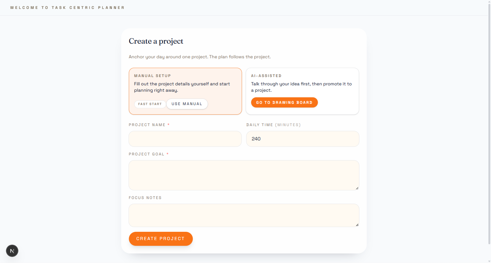
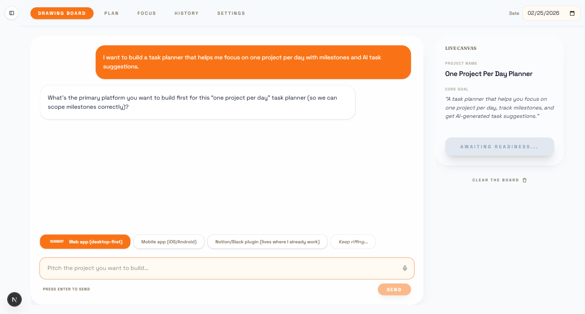
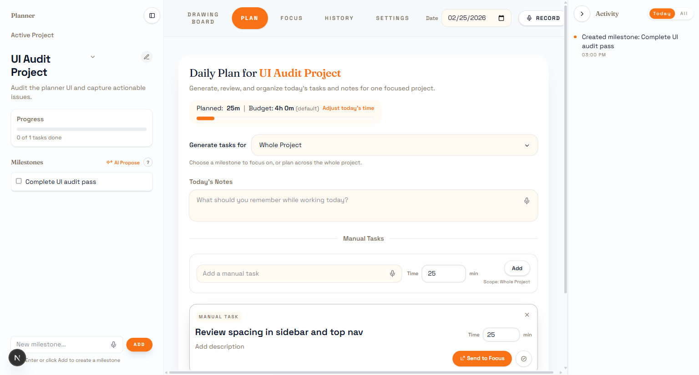

# Task Centric Planner

**Project management for the age of LLM agents.**

We outsourced a chunk of our cognition to LLMs — especially the organizational part. The irony is that the tools meant to help us think have made it harder to start, easier to scatter, and trivial to drown in half-finished plans. Azure DevOps, Jira, Linear — they were built for teams of humans coordinating with humans. None of them were designed for a world where an autonomous agent needs a structured plan, external memory, and a progress tracker to do real work.

This project is building that layer.

## The vision

**Phase 1 (now):** A local-first planner that forces single-project focus. One project, one day, one plan. AI helps you brainstorm scope, propose milestones, generate tasks, and produce execution prompts — but never takes the wheel. You stay in control of what matters today.

**Phase 2 (next):** An MCP server that exposes this planner as structured external memory for LLM agents. Any agent — coding, research, creative — can read the plan, pick up tasks, report progress, and request new work. The planner becomes the harness: **ideation → structurization → tracking**, fully autonomous.

The end state is a system where you sketch a project idea over coffee, the planner breaks it into milestones and tasks, and agents execute against it — with you reviewing progress, not managing process.

## How it works today

1. **Brainstorm** — Pitch a project idea to the AI Drawing Board. It shapes scope, milestones, and constraints before you commit.
2. **Plan** — Pick a milestone, set a time budget, generate or hand-write tasks. Pin what you like, regenerate the rest.
3. **Focus** — Lock onto one task. Generate a structured prompt you can paste into any AI assistant for implementation help.
4. **History** — Track completions over time per project.

Everything is stored in your browser (IndexedDB). No account, no server, no data leaves your machine unless you opt into AI features.

## Screenshots

| Onboarding | Drawing Board | Plan |
|---|---|---|
|  |  |  |

## Run locally

```bash
npm install
npm run dev
```

Open [http://localhost:3000](http://localhost:3000).

## AI features (optional)

AI features (task generation, milestone proposals, brainstorm, focus prompts, voice transcription) use Azure OpenAI. Without credentials, every endpoint returns safe fallback behavior — the app remains fully functional.

Copy `.env.local.example` to `.env.local` and fill in your values:

```
AZURE_OPENAI_ENDPOINT=https://your-resource.openai.azure.com
AZURE_OPENAI_RESPONSES_URL=
AZURE_OPENAI_API_KEY=
AZURE_OPENAI_DEPLOYMENT=
AZURE_OPENAI_API_VERSION=2024-10-21

AZURE_VOICE_ENDPOINT=
AZURE_VOICE_API_KEY=
AZURE_VOICE_DEPLOYMENT=
AZURE_VOICE_API_VERSION=2025-03-01-preview
```

## Tech stack

- **Next.js 16** (App Router) + **React 19**
- **TypeScript**, **Tailwind v4**
- **Zustand** for state, **Zod** for validation
- **IndexedDB** (primary) + localStorage (fallback) for persistence
- Azure OpenAI Responses API for AI features

## Project structure

```
app/
  api/ai/          # AI routes (tasks, milestones, brainstorm, focus prompts)
  api/voice/       # Voice transcription proxy
  views/           # User-facing screens (Plan, Focus, History, Settings, Brainstorm)
  components/      # Shared components (TaskCard, DictationMic, etc.)
  hooks/           # Client orchestration (AI generation, voice, drafts)
  layout/          # App shell, sidebars, header
lib/
  store.ts         # Zustand store and actions
  selectors.ts     # Derived state reads
  types.ts         # Domain types
  storage.ts       # Persistence layer
```

## License

Apache-2.0
